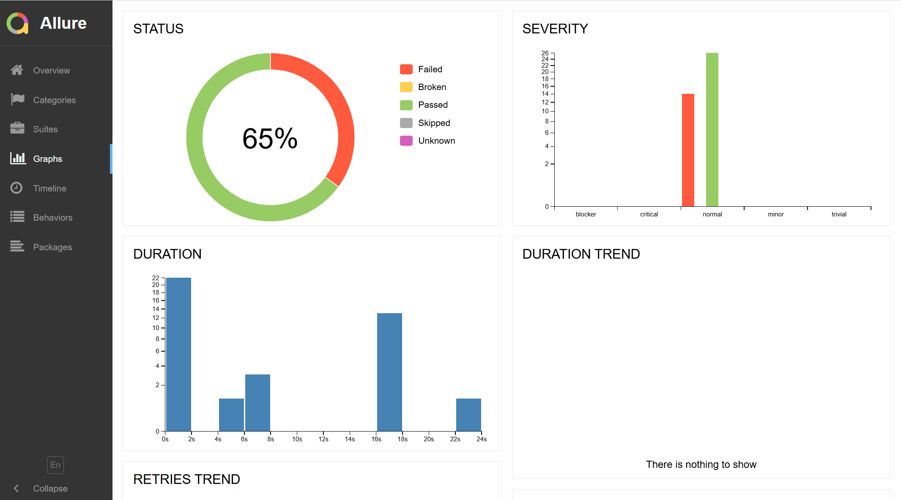

# Отчет по итогам тестирования 

## 1. Краткое описание 

### В данном проекте было проведено тестирование функциональности веб-приложения и его взаимодействия с базой данных. Основной целью тестирования является проверка корректной работы основных функций приложения и выявления возможных дефектов в работе приложения.

## 2. Количество тест-кейсов:

### Всего было написано и выполнено 50 тест-кейсов, которые охватывают различные сценарии использования приложения.   

## 3. Процент успешных и не успешных тест-кейсов:

### Из общего количества выполненных тестов 26 завершились успешно, а это составляет 52% от общего числа тест-кейсов. 24 теста завершились с ошибками, что составляет 48%  от общего числа тест-кейсов.

## 4. Общие рекомендации:

### В результате тестирования было выявлено значительное количество дефектов.
 ### Перечень рекомендаций по результатам тестирования:

 * Создать документацию с подробным описанием всех функциональностей приложения и инструкциями по тестированию. Это поможет понять особенности работы приложения, упростит процесс тестирования, что повысит качество и скорость тестирования приложения. 
 * Создать вспомогательные тестовые данные в коде страницы приложения, для точного нахождения элемента на странице, это улучшит качество и скорость тестирования приложения.
 * Заменить название ошибок во всех полях, на логически передающие смысл ошибки, так как текущие названия ошибок не отражают логический смысл ошибки. Например "Неверный формат" заменить на "Не корректное значение" или "Поле обязательно для заполнения" и так далее.  
 * Улучшить обработку сообщений об ошибках, чтобы информация в сообщении была более точной, информативной и понятной любому пользователю. Это поможет пользователю легко понять как взаимодействовать с приложением, а так же значительно снизит количество неуспешных тест-кейсов при тестировании. А значит повысит удовлетворенность пользователей приложением.  